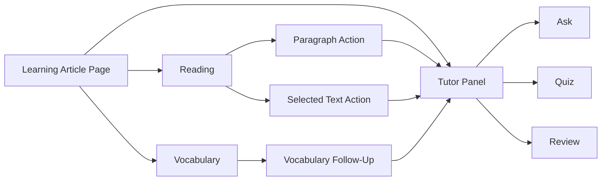

# Interactive Tutor Workspace Design

## Overview

The current learning page already supports article reading, bilingual paragraphs, vocabulary extraction, and tutor chat APIs. What is missing is a coherent interactive workspace that lets the learner ask questions while reading, request explanations for specific paragraphs or selected text, and move from passive reading into guided practice.

This document proposes a product and technical design for an interactive tutor window embedded in the learning article page.

## Product Goal

Turn the article detail page from a static result viewer into an interactive English-learning workspace where users can:

- read the article and translation side by side,
- ask article-aware questions without losing reading context,
- request explanations for the current paragraph or selected text,
- practice through lightweight quizzes,
- review key takeaways and vocabulary in one place.

## Non-Goals

- Replacing the current learning pipeline.
- Building a full classroom or course-management product.
- Supporting voice chat in the first version.
- Building cross-article long-term learner memory in the first release.

## Target Users

Primary users are intermediate Chinese software engineers learning English through technical articles. They often need:

- help understanding long and dense paragraphs,
- accurate explanation of technical expressions,
- a fast way to connect vocabulary to the source sentence,
- active recall instead of only reading translations.

## Recommended Experience

### Desktop Layout

Use a three-column workspace:

```text
+----------------------+----------------------+----------------------+
| Bilingual Reading    | Vocabulary           | Tutor                |
|                      |                      | Ask | Quiz | Review  |
| Paragraph 1          | ship at scale        |                      |
| Paragraph 2          | Pareto frontier      |  Message history     |
| Paragraph 3          | covariance           |                      |
| ...                  | ...                  |  Composer            |
+----------------------+----------------------+----------------------+
```

Recommended sizing:

- reading column: primary width,
- vocabulary column: compact secondary column,
- tutor column: fixed or bounded width panel on the right.

The article remains the anchor of the page. The tutor panel should support learning without visually taking over the experience.

### Mobile Layout

Use top-level tabs:

```text
+----------------------+
| Reading | Vocab | Tutor |
+----------------------+
| active tab content     |
|                        |
+----------------------+
```

On mobile, preserving a usable reading experience is more important than keeping all panels visible at once.

## Tutor Modes

The tutor should expose three explicit modes:

1. `Ask`
   - free-form article-aware questions,
   - explanation of concepts, sentences, and terms,
   - best for immediate comprehension support.

2. `Quiz`
   - ask the learner questions based on the current article,
   - support comprehension, vocabulary, and paraphrase checks,
   - best for active recall.

3. `Review`
   - summarize the article,
   - recap vocabulary,
   - identify weak spots from the current session once interaction tracking exists.

The recommended initial product includes all three modes conceptually, but implementation can ship in phases.

## Tutor Panel Structure

### Header

- title: article-aware tutor label,
- mode tabs: `Ask`, `Quiz`, `Review`,
- optional reset/new session control later.

### Empty State

Provide quick actions that reduce blank-page friction:

- summarize this article,
- explain the current paragraph,
- quiz me on this article,
- check whether I understood the main idea.

### Message List

Each answer should support:

- normal tutor content,
- references back to article paragraphs when relevant,
- retry state for failed requests,
- distinction between user messages and tutor messages.

Clicking a paragraph reference should scroll the article pane to that paragraph and briefly highlight it.

### Composer

The composer should support:

- free-text input,
- send button,
- contextual chips such as:
  - `Paragraph 12`
  - selected text snippet
  - vocabulary term

The visible context should make it obvious what the tutor is answering about.

## Core Interactions

### Paragraph-Level Actions

Each paragraph can expose compact actions:

- `Explain`
- `Simplify`
- `Quiz me`

These actions should open or focus the tutor panel and submit an intent-rich request scoped to that paragraph.

### Selected-Text Actions

When the learner selects text, show a small contextual toolbar:

- `Explain`
- `Translate`
- `Ask Tutor`
- `Add vocabulary`

This is especially useful for idioms, dense technical phrases, and unfamiliar sentence fragments.

### Vocabulary Follow-Up

Each vocabulary entry can offer:

- ask tutor about this word in context,
- generate another example sentence,
- test me on this word.

### Source Navigation

If the tutor references `Paragraph 18`, clicking that chip should:

- scroll the reading pane,
- highlight the paragraph,
- preserve the current tutor state.

## Primary User Flow



## Product Rollout

### Phase 1: Embedded Tutor

Must have:

- tutor panel embedded into the article page,
- chat history loading,
- free-form article-aware chat,
- quick actions,
- paragraph-level `Explain`,
- mobile `Tutor` tab,
- loading, empty, error, retry states.

### Phase 2: Contextual Learning

Add:

- selected-text actions,
- quiz mode,
- clickable paragraph references,
- vocabulary follow-up actions,
- richer intent metadata in chat requests.

### Phase 3: Guided Review

Add:

- review summaries,
- learner progress tracking,
- weak-point detection,
- cross-article memory and spaced-review hooks.

## Existing Backend Foundation

The project already has a usable backend base:

- `TutorChatController`
  - `POST /api/learning-articles/{learningArticleId}/chat`
  - `GET /api/learning-articles/{learningArticleId}/chat`
- `TutorAgentService`
  - builds article-aware prompt context and chat history,
- `ArticleTutorContextService`
  - constructs tutor context from article content and vocabulary,
- persisted chat entities
  - `ChatSessionEntity`
  - `ChatMessageEntity`

This means Phase 1 is primarily a productization and frontend integration task, not a greenfield backend project.

## API Design

### Current Shape

```java
public record ChatRequest(String message) {
}
```

### Proposed Shape

```java
public record ChatRequest(
        String message,
        Integer paragraphIndex,
        String selectedText,
        String mode,
        String intent
) {
}
```

Recommended values:

- `mode`
  - `ASK`
  - `QUIZ`
  - `REVIEW`
- `intent`
  - `FREEFORM`
  - `EXPLAIN_PARAGRAPH`
  - `SIMPLIFY_PARAGRAPH`
  - `EXPLAIN_SELECTION`
  - `VOCABULARY_HELP`
  - `GENERATE_QUIZ`

Keep the API backward-compatible by treating all added fields as optional.

## Prompt Construction

Use layered prompts instead of one large undifferentiated prompt:

1. system role
   - who the tutor is,
   - learner level,
   - required answer style.
2. article context
   - article metadata,
   - relevant paragraph or selected text,
   - optionally surrounding paragraphs,
   - related vocabulary.
3. task instruction
   - current `mode`,
   - current `intent`,
   - expected output shape.

`ArticleTutorContextService` should evolve from always injecting the whole article toward scoped context when `paragraphIndex` or `selectedText` is available. This should reduce token usage and improve answer relevance.

## Frontend Design

### Proposed Components

- `frontend/src/components/tutor/tutor-panel.tsx`
- `frontend/src/components/tutor/tutor-message-list.tsx`
- `frontend/src/components/tutor/tutor-composer.tsx`
- `frontend/src/components/tutor/tutor-empty-state.tsx`
- `frontend/src/components/tutor/tutor-mode-tabs.tsx`
- `frontend/src/components/tutor/tutor-quick-actions.tsx`

### Proposed API Module

- `frontend/src/lib/api/chat.ts`

### Page Integration

Update:

- `frontend/src/app/learning/[id]/page.tsx`

The learning page should own:

- current article,
- active paragraph,
- selected text,
- panel visibility on small screens.

The tutor components should own:

- message state,
- composer state,
- request status,
- current tutor mode.

## UI States

The first release should explicitly handle:

- no session yet,
- loading history,
- ready,
- sending,
- failed send with retry,
- backend unavailable,
- article not ready for tutoring.

The error state should stay local to the tutor panel. A failed tutor request should not break the rest of the learning page.

## Data Model Evolution

### Keep Existing Tables in Phase 1

Current chat session and message tables are enough for the first release.

### Optional Event Table Later

For later learning analytics and review features, add an interaction-event table such as:

```text
learning_interaction_event
- id
- learning_article_id
- chat_session_id
- event_type
- paragraph_index
- vocabulary_id
- payload_json
- created_at
```

Potential event types:

- `PARAGRAPH_EXPLAINED`
- `TEXT_SELECTED`
- `QUIZ_STARTED`
- `QUIZ_ANSWERED`
- `VOCABULARY_ASKED`

This table is not required for Phase 1, but it becomes useful once the product wants to summarize weak areas or personalize review.

## UX Decisions

### Why Embed the Tutor Instead of Using a Modal

A modal interrupts reading and hides the source material. The learning task benefits from keeping source text and tutor output visible together.

### Why Keep Vocabulary Visible

Vocabulary is part of the same learning loop. Users should be able to move directly from a term to an article-aware explanation or quiz.

### Why Use Explicit Modes

Different user intents need different response styles:

- `Ask` optimizes for explanation,
- `Quiz` optimizes for learner participation,
- `Review` optimizes for consolidation.

Encoding those modes explicitly is clearer than forcing users to phrase every request manually.

## Acceptance Criteria

### Phase 1

- A learner can open an article and use the tutor without leaving the page.
- Existing tutor history loads for the article.
- The learner can send a free-form message and receive an article-aware answer.
- The learner can click `Explain` on a paragraph and get a contextual answer.
- The tutor panel remains usable on mobile through a dedicated tab.
- Failed tutor requests can be retried without reloading the page.

### Phase 2

- The learner can ask about selected text directly.
- The learner can start an article-based quiz.
- Tutor answers can link back to source paragraphs.
- Vocabulary items can trigger follow-up tutor actions.

## Risks and Tradeoffs

- Injecting full article context into every tutor request is simple but costly. Scoped context is the better long-term default.
- Quiz quality depends on prompt discipline and possibly structured response formats.
- A right-side panel improves desktop productivity but requires careful mobile redesign instead of responsive compression.
- Interaction tracking should be added only when there is a concrete downstream use for it.

## Recommended Next Step

Implement Phase 1 end to end first:

1. build the tutor panel and chat API client on the frontend,
2. extend `ChatRequest` with optional context fields,
3. add paragraph-level `Explain`,
4. keep prompt construction backward-compatible,
5. verify desktop and mobile flows before adding quiz and review features.
